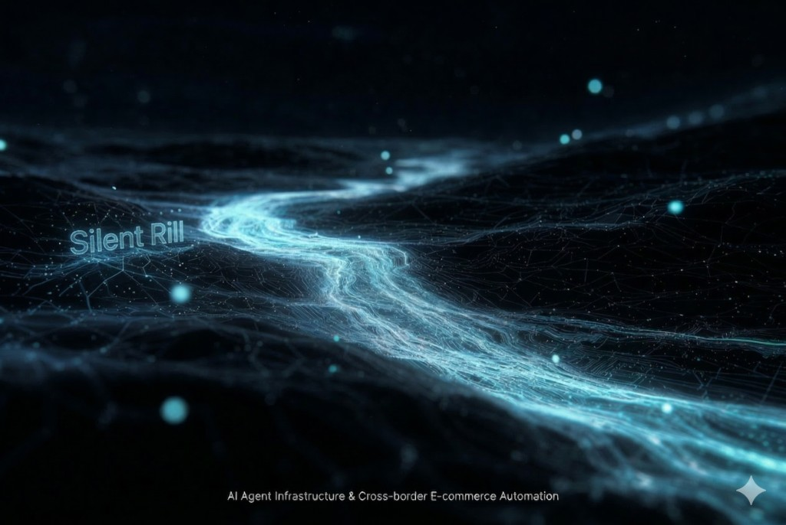

  

做 AI agent 相关的基础设施和工具，也做跨境电商的自动化。

Building infrastructure and tooling around AI agents. Also working on automation for cross-border e-commerce (dropshipping).

---

**AI Agent Infra**

- [Engram](https://github.com/lofder/Engram) — Conquer your AI with personality, not a rulebook. 以德服 AI。.
- [Durable Gateway Runtime](https://github.com/lofder/durable-gateway-runtime) — multi-channel gateway execution model. WebSocket, reconnect, session lifecycle.
- [OpenClaw Gateway Stability Patch](https://github.com/lofder/openclaw-gateway-stability-patch) — rule-based overlay for gateway WebSocket handshake stability. Python, zero deps.

**Dropshipping / E-Commerce Automation**

- [DSers MCP Product Import](https://github.com/lofder/dsers-mcp-product) — automate product import from AliExpress to Shopify via DSers. MCP server, Node.js.
- [DSers MCP Product Import (Python)](https://github.com/lofder/dsers-mcp-product-py) — same thing, Python version.

---

`MCP` `MCP server` `AI agent` `multi-agent` `agent memory` `memory architecture` `scope isolation` `gateway` `WebSocket` `session management` `reconnect` `stability patch` `overlay` `OpenClaw` `Mem0` `Qdrant` `vector database` `dropshipping` `DSers` `Shopify` `AliExpress` `e-commerce automation` `cross-border e-commerce` `product import` `bulk edit` `variant mapping` `order automation` `Python` `Node.js` `TypeScript` `open source` `developer tools` `infrastructure` `distributed systems`
